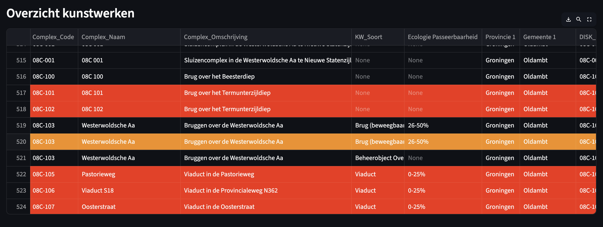

# Disk but better
> *Please* think of a better awesome name

## Running
**MacOS**
```bash
$ source venv/bin/activate
$ streamlit run main.py
```

**Windows**
```bash
$ ./venv/bin/activate.ps1
$ streamlit run main.py
```

It should show an adress and open in the terminal automatically :)


## Current data in-use
- "Complex_Code", 
- "Complex_Naam", 
- "Complex_Omschrijving", 
- "KW_Soort", 
- "Ecologie Passeerbaarheid", 
- "Provincie 1", 
- "Gemeente 1"

## Overview
