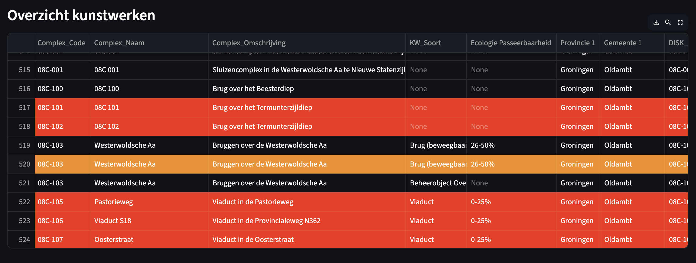

# 3Disk

## Running
**MacOS**
```bash
$ source venv/bin/activate
$ streamlit run main.py
```

**Windows**
```bash
$ ./venv/bin/activate.ps1
$ streamlit run main.py
```

**To exit**
```bash
$ deactivate
```

It should show an adress and open in the terminal automatically :)


## Current data in-use
- "Complex_Code", 
- "Complex_Naam", 
- "Complex_Omschrijving", 
- "KW_Soort", 
- "Ecologie Passeerbaarheid", 
- "Provincie 1", 
- "Gemeente 1"

## Overview


## Dev notes
I recently migrated the pip packages from python 3.9 to python 3.11 to support the NFC reader, I migrated it using the instructions [here.](https://www.activestate.com/resources/quick-reads/how-to-update-all-python-packages/)